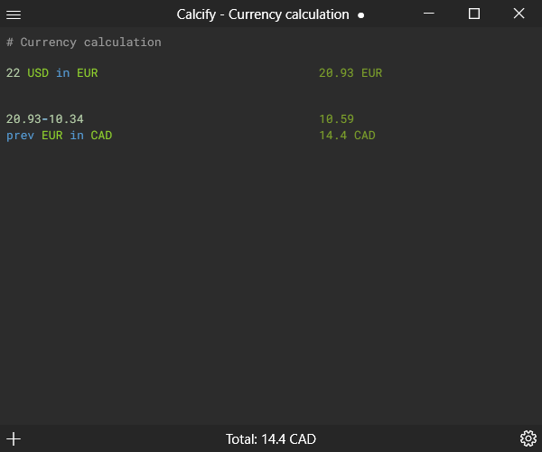

# Calcify

**A powerful calculator tool with advanced features for unit conversions, mathematical functions, and real-time currency exchange.**

[](https://tonif03.github.io/prod/calcify)
[](https://discord.gg/MfHHgYtWub)
[](https://buymeacoffee.com/tonif03)
[](LICENSE)

---

[Calcify](https://tonif03.github.io/prod/calcify) is a powerful calculator tool that goes beyond basic arithmetic, offering advanced features such as unit conversions, time and date calculations, mathematical functions, and real-time currency exchange rates. Thanks to the [Frankfurter API](https://frankfurter.app), Calcify provides up-to-date exchange rates for accurate currency conversions. Whether you're a student, professional, or enthusiast, Calcify makes complex calculations simple and accessible.



## ✨ Features

- 🌓 **Theme Support** - Dark and light theme options for comfortable viewing
- 📝 **Clean Design** - Keep track of your calculations with a simple, intuitive interface
- 📂 **Drag & Drop** - Drop supported files directly onto the window to open them
- 🔢 **Smart Calculation** - Automatic calculation of total values based on caret position
- 🌍 **Unit Conversions** - Work with:
  - 💱 Currency (real-time exchange rates)
  - 📅 Dates and time
  - ⚖️ Weight and mass units
  - 📏 Length and distance units
  - 💾 Data size units
  - 🌡️ Temperature units
  - And more!
- 🧮 **Advanced Math** - Support for complex mathematical operations and functions

**Best of all: Calcify is [Free and Open Source Software (FOSS)](https://en.wikipedia.org/wiki/Free_and_open-source_software)!**

## 📥 Installation

To install Calcify, download the latest release for your platform:

**[⬇️ Download Latest Release](https://github.com/ToniF03/Calcify/releases/latest)**

### System Requirements

- **Operating System**: Windows 7 or later
- **.NET Framework**: 4.5 or higher (usually pre-installed on Windows)

### Installation Steps

1. Download the installer from the releases page
2. Run the installer executable
3. Follow the on-screen instructions
4. Launch Calcify from your Start Menu or desktop shortcut

## 🤝 Contributing

Contributions are welcome and appreciated! Whether you're fixing bugs, proposing new features, improving documentation, or translating the app, your help makes Calcify better for everyone.

### 🐛 Reporting Bugs

Found a bug? Please [open an issue](https://github.com/ToniF03/Calcify/issues/new) with:
- A clear description of the problem
- Steps to reproduce the bug
- Expected vs. actual behavior
- Screenshots if applicable
- Your operating system and Calcify version

**Bug Categories:**
1. **Non-Critical Bugs** - Minor issues that don't significantly affect functionality
2. **Critical Bugs** - Serious issues that make Calcify barely or unusable (prioritized by core team)

### 💡 Suggesting Features

Have an idea for a new feature? We'd love to hear it!

1. **Enhancements** - Small additions to existing features
2. **Features** - Completely new functionality (may be larger projects)

Please [open a feature request](https://github.com/ToniF03/Calcify/issues/new) describing:
- What you want to achieve
- Why it would be useful
- Any implementation ideas you might have

### 🔧 Contributing Code

1. Fork the repository
2. Create a feature branch (`git checkout -b feature/AmazingFeature`)
3. Make your changes
4. Commit your changes (`git commit -m 'Add some AmazingFeature'`)
5. Push to the branch (`git push origin feature/AmazingFeature`)
6. Open a Pull Request

If you know where a bug is in the code or have ideas on how to fix it, feel free to share your solution!

### 📚 Contributing Documentation

Documentation is crucial for users and developers alike. Help improve our docs:

- **Repository**: [calcify-docs](https://github.com/tonif03/calcify-docs)
- **How to contribute**:
  1. Fork the documentation repository
  2. Fix typos, improve explanations, or add missing content
  3. Submit a pull request

**Translation Needed!** Help make Calcify accessible to more users by translating documentation into other languages.

## 🏗️ Building from Source

### Prerequisites

- Visual Studio 2019 or later
- .NET Framework 4.5 SDK or higher
- NuGet Package Manager

### Build Steps

```bash
# Clone the repository
git clone https://github.com/ToniF03/Calcify.git
cd Calcify

# Restore NuGet packages
nuget restore Calcify.sln

# Build using MSBuild or open Calcify.sln in Visual Studio
msbuild Calcify.sln /p:Configuration=Release
```

The compiled executable will be in `Calcify/bin/Release/`.

## 🛠️ Technologies Used

- **Framework**: WPF (Windows Presentation Foundation)
- **Language**: C#
- **Libraries**:
  - [AvalonEdit](https://github.com/icsharpcode/AvalonEdit) - Text editor component
  - [Newtonsoft.Json](https://www.newtonsoft.com/json) - JSON parsing
  - [Microsoft.UI.Xaml](https://github.com/microsoft/microsoft-ui-xaml) - UI components
- **APIs**:
  - [Frankfurter API](https://frankfurter.app) - Currency exchange rates

## 📄 License

This software is licensed under the [MIT License](LICENSE).

```
MIT License

Copyright (c) 2025 ToniF03

Permission is hereby granted, free of charge, to any person obtaining a copy
of this software and associated documentation files (the "Software"), to deal
in the Software without restriction, including without limitation the rights
to use, copy, modify, merge, publish, distribute, sublicense, and/or sell
copies of the Software, and to permit persons to whom the Software is
furnished to do so, subject to the following conditions:

The above copyright notice and this permission notice shall be included in all
copies or substantial portions of the Software.

THE SOFTWARE IS PROVIDED "AS IS", WITHOUT WARRANTY OF ANY KIND, EXPRESS OR
IMPLIED, INCLUDING BUT NOT LIMITED TO THE WARRANTIES OF MERCHANTABILITY,
FITNESS FOR A PARTICULAR PURPOSE AND NONINFRINGEMENT. IN NO EVENT SHALL THE
AUTHORS OR COPYRIGHT HOLDERS BE LIABLE FOR ANY CLAIM, DAMAGES OR OTHER
LIABILITY, WHETHER IN AN ACTION OF CONTRACT, TORT OR OTHERWISE, ARISING FROM,
OUT OF OR IN CONNECTION WITH THE SOFTWARE OR THE USE OR OTHER DEALINGS IN THE
SOFTWARE.
```

For third-party licenses, see the [Licenses](Licenses/) directory.

## 👨‍💻 Author

**ToniF03**
- GitHub: [@ToniF03](https://github.com/ToniF03)
- Website: [tonif03.github.io](https://tonif03.github.io)

## 💖 Support

If you find Calcify helpful, consider supporting the project:

[](https://buymeacoffee.com/tonif03)

Your support helps maintain and improve Calcify!

## 🌟 Acknowledgments

- [Frankfurter API](https://frankfurter.app) - For providing free, reliable currency exchange rate data
- [AvalonEdit](https://github.com/icsharpcode/AvalonEdit) - Excellent text editing component
- All contributors and users who help make Calcify better

---

**Made with ❤️ by the Calcify community**
